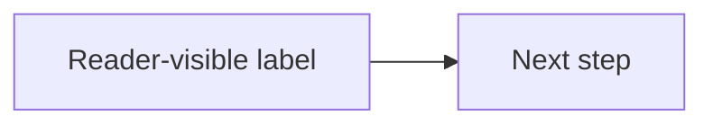

# Mermaid Diagrams

## Operating Rule

Design diagrams as documentation artifacts, not decorations. Start from the question the reader needs answered, choose the smallest diagram type that can answer it, and keep the Mermaid code compatible with GitHub Markdown unless the user explicitly targets another renderer.

For GitHub READMEs, always emit diagrams in fenced blocks:

````markdown

````

## Workflow

1. Identify the documentation job:
   - System shape: use `flowchart`, C4, or `architecture-beta`.
   - Runtime interaction: use `sequenceDiagram`.
   - Data model: use `erDiagram`.
   - Lifecycle or protocol: use `stateDiagram-v2`.
   - Branching/release story: use `gitGraph`.
   - Chronology or roadmap: use `timeline`.
   - Classification or tradeoffs: use `quadrantChart`, `mindmap`, or a structured flowchart.

2. Check the target renderer:
   - GitHub README, PR, issue, wiki, or discussion: read `references/github-compatibility.md`.
   - Mermaid Live Editor, custom docs site, or local rendering: GitHub limits may be relaxed, but say which assumptions changed.

3. Draft the diagram from the reader's path:
   - Put the most important actor, user, request, or system at the left/top.
   - Use subgraphs, boundaries, or boxes to show ownership and trust boundaries.
   - Label edges with verbs or protocols, not vague nouns.
   - Use colors sparingly to encode status, risk, responsibility, or layer.

4. Make it robust:
   - Quote labels containing punctuation, symbols, brackets, markdown, or the word `end`.
   - Avoid raw HTML, click handlers, external icon packs, custom CSS, JavaScript callbacks, and renderer-specific plugins for GitHub.
   - Prefer explicit node ids plus quoted labels: `api["Public API"]`.
   - Keep diagrams scannable under README width. Split after roughly 25 to 35 nodes or when edge crossings dominate.

5. Validate:
   - For Markdown files, run `scripts/github_mermaid_check.py <file.md>` for fence and static checks.
   - If local Mermaid CLI is available or network use is acceptable, run `scripts/github_mermaid_check.py --render <file.md>` to render each block through `mmdc`.
   - For exact GitHub behavior, include an `info` block temporarily in a draft Markdown page to see GitHub's current Mermaid version, then remove it unless the user wants to keep it.

## Quality Bar

Do not produce toy examples when the user asks for complex or useful diagrams. A strong Mermaid diagram usually has:

- A clear reading order and a single purpose.
- Real domain labels instead of placeholders like `A`, `B`, `C`.
- Semantic grouping with `subgraph`, C4 boundaries, sequence boxes, ERD entities, or state composites.
- Edge labels that explain why things connect.
- A restrained visual grammar: one neutral base plus 2 to 4 meaningful accent classes.
- Enough detail to prevent ambiguity, but not so much that the README becomes unreadable.

## References

Load only what matches the task:

- `references/github-compatibility.md`: GitHub README support, safe syntax, pitfalls, validation.
- `references/diagram-selection.md`: which Mermaid type to choose and when to split diagrams.
- `references/advanced-patterns.md`: complex architecture, sequence, ERD, state, Git graph, and timeline patterns.
- `references/style-guide.md`: color, labels, layout, accessibility, and README polish.
- `references/source-index.md`: official sources checked when this skill was created.
