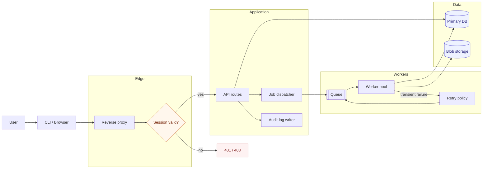
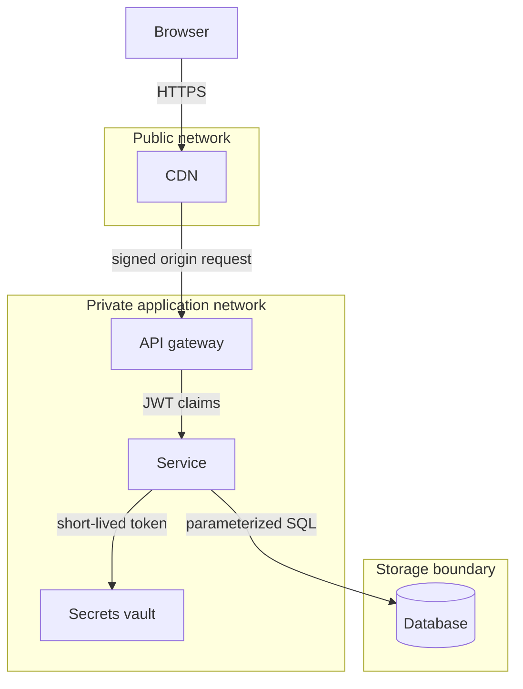
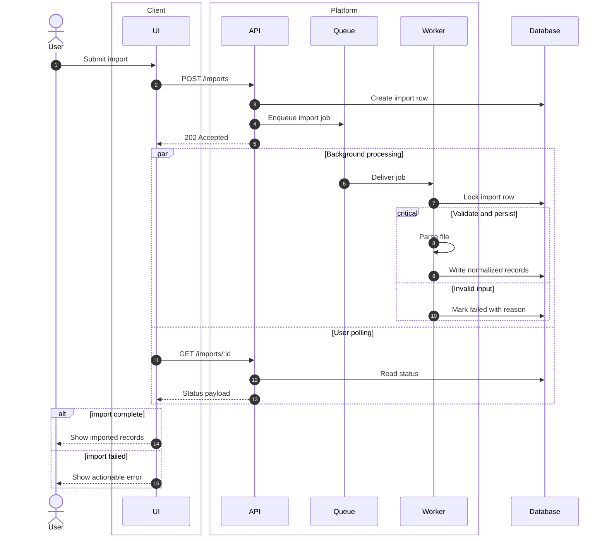
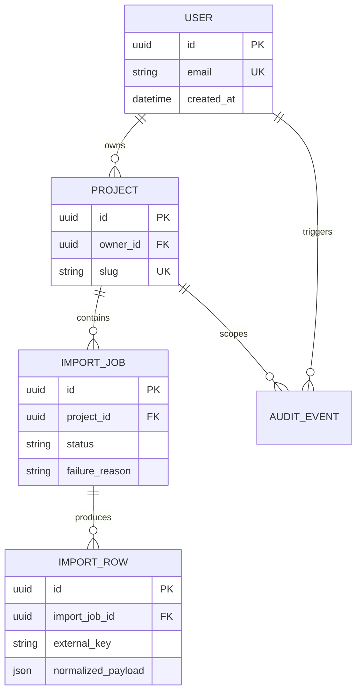
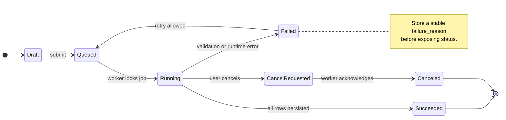
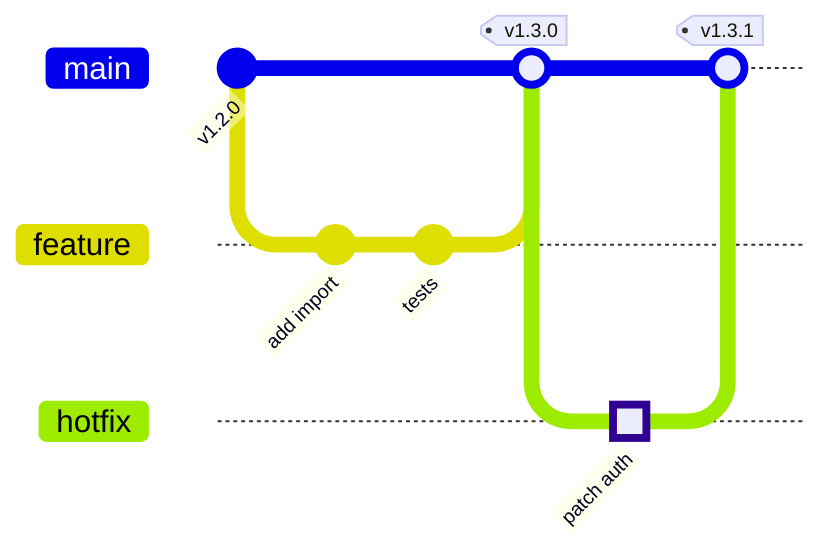
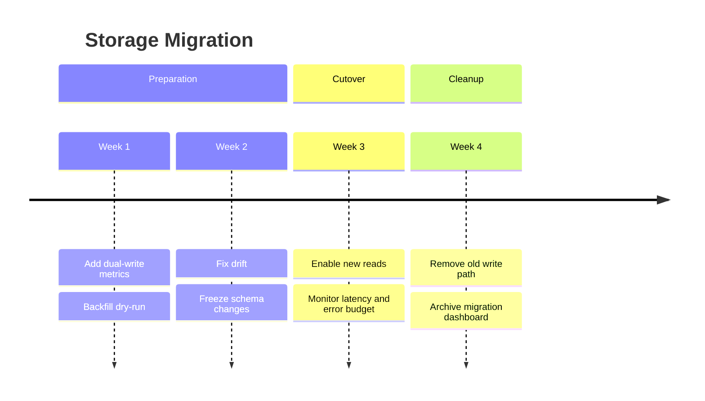

# Advanced Patterns

## README Architecture Map

Use this for complex systems where GitHub compatibility matters. It avoids experimental diagram types but still shows ownership, async paths, storage, and failure handling.

## Trust Boundary Flow

Make trust boundaries explicit and label edges by protocol or credential.

## Deep Sequence With Failures

Use `box`, `alt`, `par`, `critical`, and `break` to keep complex workflows readable.

## ERD With Intentional Attributes

Show only attributes that explain identity, cardinality, or reader-facing meaning.

## State Machine Contract

Use state diagrams when invalid transitions are a bug.

## Release Story With GitGraph

Use `gitGraph` to explain release strategy, rollback, or hotfix flow.

## Migration Timeline

Use timelines for planning and postmortems, but verify GitHub support first.

