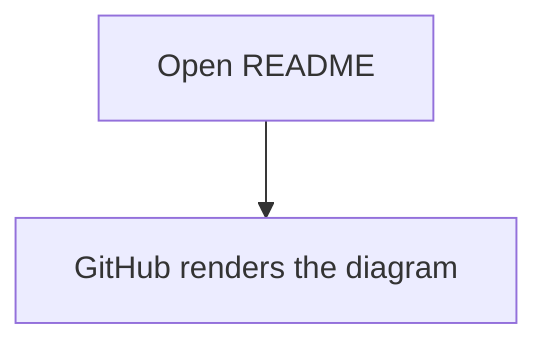
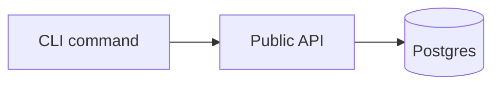
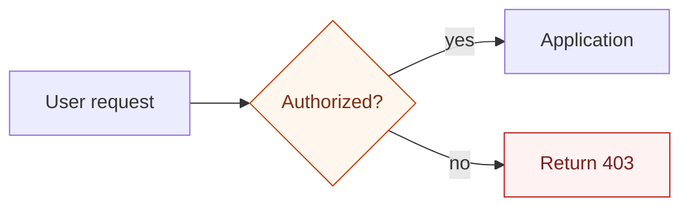
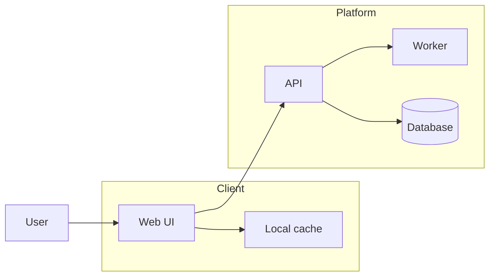

# GitHub Compatibility

## Ground Truth

GitHub renders Mermaid in Markdown files, issues, pull requests, discussions, and wikis when the diagram is inside a fenced code block with the `mermaid` language identifier.

```markdown

```

GitHub's renderer is not guaranteed to match the newest Mermaid documentation. When using newer Mermaid features, first check the renderer version:

```markdown
```mermaid
info
```
```

Use the `info` diagram as a temporary compatibility probe in a branch, issue, gist, or scratch README. Remove it from polished docs unless version disclosure is useful to readers.

## Safe README Core

Prefer these for GitHub READMEs:

- `flowchart` or `graph` with explicit directions: `TD`, `LR`, `BT`, `RL`.
- `sequenceDiagram` with participants, actors, notes, loops, `alt`, `opt`, `par`, `critical`, and `break`.
- `erDiagram` with crow's-foot relationships and attributes.
- `stateDiagram-v2` with start/end, composite states, choices, forks, joins, notes, and direction.
- `gitGraph` for branch/release narratives.
- `pie`, `journey`, and basic `timeline` for compact narrative diagrams, after checking render support.

Use caution for:

- C4 diagrams: Mermaid marks C4 as experimental. GitHub may lag or render differently.
- `architecture-beta`: useful for cloud/resource maps, but it requires recent Mermaid support.
- New flowchart shapes from Mermaid v11.3.0+, edge ids from v11.10.0+, and newer sequence half-arrows or central connections from v11.12.3+.
- ELK layout and `look` frontmatter. These depend on Mermaid version and renderer configuration.
- Icons, images, Font Awesome, click handlers, external CSS, and JavaScript callbacks. GitHub's Mermaid rendering is sandboxed and README readers should not depend on interactive behavior.

## README-Safe Patterns

Use quoted labels and stable ids:



Use semantic classes, not broad theming:



Use subgraphs for ownership:



## Common Breakers

- Lowercase `end` can break flowcharts and sequence diagrams. Quote it or capitalize it: `"end"`, `End`, or `END`.
- Flowchart node ids that start with `o` or `x` immediately after some edge syntax can be parsed as circle or cross edge markers. Add a space or capitalize the node id.
- Comments start with `%%` and should be on their own line. Avoid `{}` inside Mermaid comments because directive-like comments can confuse renderers.
- Unknown words and misspellings usually break diagrams. Bad parameter names may silently fail.
- Spaces, punctuation, markdown, unicode, brackets, and many symbols should be inside quoted labels.
- Long labels can overflow or make GitHub READMEs hard to scan. Break labels intentionally or split the diagram.

## Validation

Run the bundled checker on Markdown files:

```bash
python3 ~/.codex/skills/mermaid-diagrams/scripts/github_mermaid_check.py README.md
```

For syntax rendering through Mermaid CLI:

```bash
python3 ~/.codex/skills/mermaid-diagrams/scripts/github_mermaid_check.py --render README.md
```

`--render` uses a local `mmdc` if available, otherwise `npx -y @mermaid-js/mermaid-cli`. This catches many syntax failures but is still not exact proof of GitHub's pinned renderer version.
