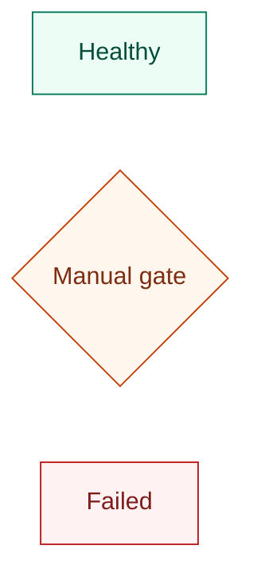

# Style Guide

## Labels

- Use reader-visible labels in quotes: `api["Public API"]`.
- Keep ids stable and machine-like: `api`, `worker_pool`, `audit_log`.
- Label edges with verbs, protocols, events, or decisions: `-->|valid token|`.
- Prefer nouns for nodes and verbs for edges.
- Avoid placeholders unless showing minimal syntax.

## Layout

- `LR` works well for request flow, pipelines, and architecture.
- `TD` works well for layered systems, state funnels, and decision trees.
- Put human actors on the far left or top.
- Put persistence on the far right or bottom.
- Keep error or denial branches short and visually distinct.
- Use subgraph names as boundary labels, not prose explanations.

## Color

Use color as an information channel:

- Neutral: ordinary services or containers.
- Indigo or blue: storage, platform, durable state.
- Orange: decisions, warnings, manual gates.
- Red: failures, denied paths, destructive operations.
- Green: success or healthy terminal state.

Prefer classes:

Avoid one-off `style` statements for every node unless only one node needs emphasis.

## GitHub README Polish

- Put a one-sentence caption before the diagram if the surrounding section title is not enough.
- Avoid explaining Mermaid syntax in visible README prose unless the README is about Mermaid.
- Keep code fences flush with surrounding Markdown.
- Do not put huge diagrams near the top of a README unless they are the main product signal.
- For large architecture docs, put the overview in README and deeper Mermaid diagrams under `docs/`.

## Accessibility

- Do not rely on color alone. The label or edge text should still communicate status.
- Keep contrast high: pale fills with dark strokes and dark text usually render well on GitHub.
- Avoid tiny font-size overrides.
- Prefer explicit labels over icons.
- Keep diagrams useful if rendered monochrome.

## Complexity Control

Before finalizing, ask:

- What question does this diagram answer?
- Which node can be removed without losing the answer?
- Which crossing edge can be eliminated by changing direction or splitting the diagram?
- Can one subgraph become its own follow-up diagram?
- Does every accent color encode meaning?
