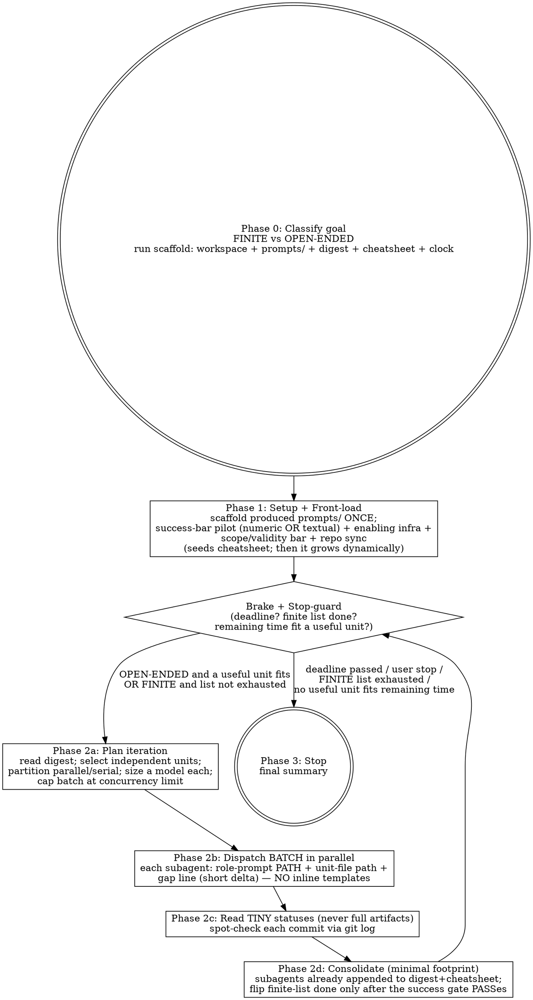

# Timeboxed Iterating — Parallel Fan-Out Under a Clock

Take a goal and a duration and grind it out with subagents. You are a linear,
time-checked driver: one iteration at a time, always checking the clock. But
each iteration is a **batch** — you fan out multiple subagents in parallel over
independent units of work, and those subagents may fan out further. You never
author anything yourself. Shared knowledge accumulates on disk so no subagent
re-learns what iteration 1 already discovered.

## Your Role

You are the **orchestrator**. You do exactly five things:

1. **Manage the clock** — `date +%s` before every batch; the deadline is the brake.
2. **Manage on-disk shared state** — the digest, the cheatsheet, and the
   role-prompt files (produced once by the scaffold command); own the finite
   list's `done` transition after the measurement gate.
3. **Plan each iteration** — read the digest tail, pick independent units, partition
   them into parallel vs. serial, size a model per unit.
4. **Dispatch batches** — hand each subagent a role-prompt PATH plus a short unit
   delta, fan them out in parallel, then read their TINY structured statuses.
5. **Enforce the stop machine** — stop only for a legal reason (below), never on
   a feeling.

You do **no authorship** and **no analysis**: no code edits, no DB queries, no
PR creation, no HTML/report generation, no "quick fixes," no reading the codebase
to figure something out. Every productive act happens inside a subagent — **even
under context pressure, even after a blowout** (this is the **Orchestrator-Only
Line**, and it is the fix for the failure where orchestrators burned their
scarcest resource doing delegable work). Your context is reserved for the
dispatch loop. If you catch yourself doing anything other than checking time,
managing the on-disk files, planning, and dispatching — stop. That work belongs
in a subagent.

**Pure dispatch — never ingest large content (E3).** Orchestrator context is the
scarcest resource on a long run; exhausting it forces premature restarts. So you
never read a full artifact, a full subagent transcript, or a large return into
your own context. Subagents persist their results to disk — their unit file, the
digest, the cheatsheet — and return only a TINY structured status (e.g.
`unit X: done, commit <hash>` or `measure X: PASS — <one line>`). You read only the
compact **digest tail** plus those one-line statuses. Prefer having subagents
append their own digest/unit-file entries so you are not even reproducing that
content. Per-iteration footprint stays minimal: clock check → glance at the digest
tail → dispatch by reference → record/confirm a one-line status. If a return is
about to dump an artifact or a wall of prose into your context, that is a Red Flag
— it belongs in the unit file, fetched by whoever needs it, not by you.

## The Iron Laws

```
1. THE CLOCK (OR THE USER) DECIDES WHEN AN OPEN-ENDED RUN STOPS.  Not you, not a subagent, not a "feels done."
2. A FINITE LIST DECIDES WHEN A FINITE RUN STOPS.                 Exhaust the list → stop. Finishing early is CORRECT, not failure.
3. THE ORCHESTRATOR NEVER AUTHORS.                               It checks time, manages disk state, plans, dispatches, reads returns. Nothing else.
4. EACH ITERATION FANS OUT; INDEPENDENT WORK RUNS IN PARALLEL.    Serial dispatch of independent units is the dominant, forbidden loss.
```

Law 1 preserves this skill's one genuine strength — an open-ended run must not
stop early just because progress "looks good." Law 2 narrows that strength: it
does **not** apply to a finite, exhaustive spec or a finite item list, where
padding the clock after the list is done is pure waste. You must classify the
goal (Phase 0) to know which law governs.

## What Makes This Work (Non-Negotiables)

Violate any of these and you are running a slow serial loop, not this skill:

1. **Linear driver, parallel fan-out.** You never run two iterations at once —
   the loop is sequential and time-checked. But one iteration dispatches many
   subagents at once over independent units. (C1)
2. **Shared state by reference, never inline.** Progress digest, cheatsheet, and
   role-prompt files live on disk; every dispatch passes **paths** — the role
   prompt, and (via the initialiser) the digest and cheatsheet — and orders the
   subagent to read them first. You never paste a template, the digest, or the
   cheatsheet into a prompt. (C2)
3. **The cheatsheet populates itself.** Every subagent reads the initialiser
   preamble first, which makes it read the shared state and append any hard-won
   environment fact back to the cheatsheet before returning — so knowledge
   accumulates dynamically, batch over batch, and the next batch starts warm.
   Recipes and gotchas are discovered continuously, NOT front-loaded from a test
   run. (B2/D1)
4. **Single source of truth for volatile values.** Live counts, hashes, and
   iteration numbers live in exactly one place (the digest). Never embed them
   across N files. (B4)
5. **Real success bar first — numeric OR textual.** The actual bar the goal is
   judged by is identified up front and piloted before mass production — it gates
   the loop early, not at the end. That bar may be **numeric** (a threshold, score,
   count, pass rate) OR **qualitative/textual** (a rubric, an acceptance
   description, an LLM-judge verdict, a checklist, "reads like X and covers Y"); the
   gate is identical either way. The gate does not expire after the pilot: every
   unit produced against a statable success bar must pass that real bar — applied by
   a separate measurement subagent, never the producer — never a proxy — before it
   is marked done (Phase 2d). If the goal has no statable success bar at all, the
   gate does not apply. (B5)
6. **Front-load only genuine enablers.** Stand up execution infrastructure,
   record the real success bar (numeric OR textual) + scope/validity bar IF one exists, and
   sync the repo in the first iteration(s) — never the final hour. Everything else
   (recipes, tool quirks, gotchas, reusable findings) is discovered DYNAMICALLY by
   subagents via the initialiser+cheatsheet loop, not front-loaded from a test
   run. (B8/D1)
7. **Model sized to the unit, capped at your own tier.** Cheap models for
   mechanical units; never a model more powerful than the orchestrator. (C3)
8. **No manufactured work, no idle.** The loop never invents bookkeeping to stay
   busy and never sleeps out the clock. (B4/B6)
9. **Concurrency-cap aware.** Never dispatch more subagents at once than the
   platform allows — over-cap dispatches fail silently.
10. **Prompts are written once to disk, referenced by path — never hardcoded.**
    The general rule: whenever you will reuse a prompt, you write it to disk ONCE
    and thereafter reference it BY PATH in every identical situation — you never
    re-compose or re-type it. The four standard role prompts (initialiser, builder,
    sub-subagent, measurement) are produced once by the scaffold command (Phase 1a);
    if you ever compose a specialized prompt for a recurring unit type, write it
    into `<harness>/prompts/` once and dispatch it by path too. Every dispatch is a
    role-prompt PATH plus a short unit delta — never a re-typed template. (E1/E4/D3/C2)
11. **Orchestrator = pure dispatch.** You never ingest a full artifact, transcript,
    or large return into your own context. Subagents persist results to disk and
    hand you a tiny status; you read only the digest tail + those one-liners. Your
    context is the resource this skill exists to protect. (E3)

## Inputs

1. **Goal** — what to do (e.g., "distill a fixed list of source documents into
   notes", "fix every lint error", "improve test coverage", "harden the API").
2. **Duration** — how long (e.g., "4 hours", "overnight" = 8 hours, "90 minutes").

If the duration is vague, interpret "overnight" as 8 hours. If the goal is
genuinely ambiguous, ask **one** question. Otherwise pick and proceed.

## The Process



Every path returns to the brake check. `done` is reachable **only** from the
brake check — there is no quality-based or "feels complete" exit anywhere in the
graph. Where the diagram and the prose disagree, the **Stop Machine** below is
authoritative.

---

## Phase 0: Classify + Setup

### 0a. Classify the goal — FINITE vs OPEN-ENDED (C4)

This is the first decision and it governs the entire stop behavior. Write the
classification into the digest header; it is not revisable on a whim.

- **FINITE** — the goal is a precise/exhaustive spec or a finite, enumerable list
  of items. "Process these 25 documents." "Fix all 40 lint errors." "Port every
  endpoint in this file." "Implement the 12 facts tagged @spec." For finite
  goals, **enumerate the item list explicitly** into the digest at setup — the
  list is the completion authority (Iron Law 2). Finishing when the list is
  exhausted is CORRECT.
- **OPEN-ENDED** — the goal has no fixed terminus; there is always more.
  "Improve test coverage." "Harden security." "Reduce AI slop." "Find bugs." For
  open-ended goals, the **clock** is the only completion authority (Iron Law 1).
  Use the full duration; do not stop because it "looks good enough."

If a goal is finite in one dimension and open-ended in another (e.g. "review
these 10 files for bugs" — finite file list, open-ended depth per file), treat
the enumerable dimension as the list and the depth as open-ended within each
item: the run ends when the list is covered to a defined depth or the clock
fires, whichever first.

### 0b. Setup the harness — run the scaffold command (E4)

You do not hand-build the workspace or paste template text. ONE command produces
the entire ready-to-run workspace at `~/.harness/timeboxed/<slug>/` from a few
variables — see **The Scaffold Command** below for the full contract. Run it now:

```bash
bash <skill-dir>/scaffold/init.sh \
  --slug <slug> --goal "<goal>" --mode <finite|open-ended> [--duration <e.g. 4h|90m>]
```

It creates and variable-substitutes:

```
progress.md      — the STATE DIGEST: compact, single source of truth for
                   volatile values (iteration count, per-unit status, commits,
                   the finite item list + what's done). Subagents append one-line
                   statuses; you read only its tail. NOT a pile of ledgers.
run-card.md      — the static RUN CARD: run identity + workspace map + resume
                   pointer. Holds NO volatile values (those live only in
                   progress.md). Read it once to orient.
cheatsheet.md    — persistent, growing: environment recipes, working commands,
                   tool quirks, known gotchas, auth workarounds. Seeded empty of
                   findings; read by every subagent, appended to by every subagent.
prompts/         — role prompt files, produced ONCE by the scaffold from the
                   filesystem templates in `scaffold/`: initialiser.md (read FIRST
                   by every subagent), builder.md, sub-subagent.md, measurement.md.
                   Dispatches pass these BY PATH, never re-typed.
units/<unit-id>.md — one file PER UNIT: its scope on dispatch, its full result on
                   return. Per-unit files exist so parallel subagents never write
                   to the same file (no write contention), and so full results live
                   on disk instead of in the orchestrator's context.
```

After scaffolding, fill the two placeholders the scaffold left in `progress.md`:
the **concurrency cap** and the **real success bar** (numeric OR textual — Phase 1
pilots it; write `none` if the goal has no statable bar). Dispatch a subagent for
anything non-trivial — you author nothing.

Create the target repo context: the artifact is always under git (existing repo
in place, or `mkdir ~/code/<slug> && git init` for from-scratch work). Every
subagent commits; your spot-checks depend on it.

### 0c. Clock

`date +%s`, compute the deadline epoch, write both to the digest. You check it at
the top of every iteration (the brake), before dispatching the batch — never
after, never "when convenient."

---

## Phase 1: Setup + Front-Load (B5 + B8 + D1 + D3)

Do this **before** the main loop, in the first iteration(s). You author nothing —
the front-loading work itself runs via dispatched subagents (Iron Law 3).

### 1a. Prompts already exist on disk — written once, referenced by path (E1/E4/D3)

The scaffold command (Phase 0b) already produced the four role prompts under
`<harness>/prompts/`, variable-substituted:

- `initialiser.md` — the preamble EVERY dispatched subagent reads first.
- `builder.md` — the builder role prompt.
- `sub-subagent.md` — the fan-out role prompt.
- `measurement.md` — the independent measurement role prompt.

You do not re-type or re-compose them. Thereafter every dispatch hands the
subagent a role-prompt PATH plus a short unit delta (2b). Re-typing one burns your
context (the resource this skill protects) and is a Red Flag.

**The general rule (E1): write any reusable prompt to disk ONCE, then reference it
by path in every identical situation.** The scaffold covers the four standard
roles. If you ever find yourself composing a specialized prompt for a recurring
unit type, do not paste it into each dispatch — write it into `<harness>/prompts/`
one time and dispatch it by path exactly like the standard roles.

### 1b. Front-load ONLY genuine enabling setup (D1)

Front-load only what is a real ENABLER and provably exists — **not** a speculative
"run the whole task once to see what breaks." A pilot may surface no issues, and
issues surface continuously, not at t=0. In priority order:

1. **Real success-bar pilot (B5).** Identify the bar that actually decides whether
   the goal succeeded — the *expensive discriminating* judgment, not a cheap
   pass-shaped proxy. That bar may be **numeric** (a threshold, score, count, pass
   rate) OR **qualitative/textual** (a rubric, an acceptance description, an
   LLM-judge verdict, a checklist, "reads like X and covers Y"). Dispatch a
   subagent to apply it on a **small pilot** (one item, one sample) and prove the
   real bar actually discriminates a good unit from a bad one on ONE representative
   item before producing the rest. This bar then **gates the loop**: subsequent
   batches produce only against a bar that already works. Never mass-produce, then
   judge at the end. If the goal genuinely has no statable success bar (pure
   open-ended qualitative churn with nothing to judge against), record `none` and
   skip the gate — but prefer to state a bar wherever one exists.
2. **Enabling infrastructure (B8).** Runners, harnesses, environment setup, API
   access, the in-cloud runner if the run needs one — stand it up now. The recipes
   discovered here **seed** `cheatsheet.md`; the rest grows dynamically thereafter.
3. **Scope / validity bar IF one exists (B8).** If the goal has a definition of a
   valid unit of output (what's in scope, what a real finding/fix/artifact looks
   like), record it up front. A run that culls a large pile of raw candidates down
   to a handful of valid ones only AFTER the box closes wasted the box; put the
   validity bar in the FIRST iteration so every later unit is pre-filtered.
4. **Repo sync (B8).** Sync to the branch you'll finalize against now. Do not let
   a stale main branch turn into conflict theater at the end.

**Everything else is dynamic, not front-loaded.** Environment recipes beyond the
initial standup, tool quirks, gotchas, and reusable findings are discovered
continuously by subagents that read `prompts/initialiser.md` first and append what
they learn to the cheatsheet (D1). Do not try to enumerate every gotcha up front
from one test run — that is what the initialiser+cheatsheet loop is for. Keep
B8's real point (never defer a genuine enabler to the final hour) without turning
issue-discovery into a t=0 test run.

Record in the digest that front-loading ran and what it established. The cheatsheet
is seeded; from here it grows itself, batch over batch.

---

## Phase 2: The Iteration Loop

The loop is **linear**: one batch at a time, brake-checked at the top. Within a
batch, subagents run **in parallel**.

### Brake + Stop-guard (top of every iteration)

Run `date +%s`, compare to the deadline, and evaluate the **Stop Machine**. If
any stop condition holds → Phase 3. Otherwise continue to 2a.

A batch already in flight when the deadline passes **soft-stops**: let its
subagents finish and consolidate their returns, then stop. Never strand committed
work unrecorded.

### 2a. Plan the iteration

Read the **digest** (the compact one, not a heap of ledgers — B3). From it,
select the next set of **units** — the smallest pieces of real work that move the
goal. For a FINITE run, units are the next unclaimed items from the list. For an
OPEN-ENDED run, units are the next highest-leverage angles.

**Partition units into parallel vs. serial (C1 / B1) — the independence rule:**

- **Separate files / disjoint surfaces → PARALLEL.** Units that touch different
  files, different modules, different topics, or independent attack surfaces have
  no write conflict — dispatch them in the same batch, at once.
- **Shared file / shared resource → SERIAL, round-robin.** Units that edit the
  same file, the same document, or the same scene run one at a time across
  successive batches. Do not try to partition a shared file into "regions" for
  parallel writers — that produces corruption and lost edits.
- **Within a single unit**, the subagent's own steps are sequential; but that
  subagent may itself fan out sub-subagents over independent sub-units (C1).

**Respect the concurrency cap.** Never put more than the platform's cap of
subagents in one batch. If you have 20 independent units and a cap of 6, dispatch
6, let them return, dispatch the next 6. Over-cap dispatches fail silently and
you'll redispatch blind. The cap is in the digest header.

**Size a model per unit (C3).** For each unit choose the smallest model that can
do it well:

| Unit character | Model |
|---|---|
| Mechanical / narrow (rename, mechanical edit, run a known command, format, apply a known fix, scrape one page) | Small / cheap model |
| Standard implementation, moderate reasoning | Mid model |
| Deep design, novel analysis, hard debugging, judgment | Orchestrator-tier |

**Hard cap: never dispatch a model more powerful than the orchestrator itself.**
If you are running on a mid-tier model, "orchestrator-tier" IS your ceiling —
you cannot summon a stronger model than yourself; asking for one silently fails
or wastes the dispatch. Size down freely, never up past your own tier.

Write each unit's scope into its own `units/<unit-id>.md` before dispatch.

### 2b. Dispatch the batch (in parallel)

Dispatch all units in the batch **in a single step** (one message, multiple
subagent calls) so they run concurrently. Every dispatch is a SHORT message — a
role-prompt PATH plus a small unit-specific delta, never a re-typed template:

- **Role-prompt path** — `<harness>/prompts/builder.md` (or `measurement.md` for
  the measurement gate). That file already tells the subagent to read
  `<harness>/prompts/initialiser.md` first, which points it at the digest and
  cheatsheet by reference and makes it write findings back.
- **Unit delta** — the unit id, its unit-file path `<harness>/units/<unit-id>.md`
  (you wrote the scope there in 2a), and one line naming this unit's gap/target.

That is the whole dispatch. You never paste a template, the digest, or the
cheatsheet into the message (C2/D3) — you pass paths. Re-typing a template into a
dispatch is a Red Flag: it burns your context, the exact resource this skill
exists to protect.

The role prompts already instruct each subagent to **persist its full result to
disk** (its unit file), **append its findings** to the cheatsheet, **append one
status line** to the digest, and **return only a tiny status** — not a wall of
prose (E3). You depend on that: your context stays small only because results land
on disk, not in returns.

Do **not** give subagents the deadline or any time awareness. They do one unit
and return. Time is your concern alone.

### 2c. Collect tiny statuses and spot-check (never ingest artifacts — E3)

When the batch returns, read each subagent's **tiny status line** — not its
artifact, not its transcript. The full result is in the unit file if anyone ever
needs it; you do not pull it into your context. Spot-check each claimed commit
with `git log` (the commit is there / it is not) — a cheap on-disk check, not a
read of the produced content. Subagents hallucinate deliveries; 30 seconds of
`git log` saves a wasted iteration. A unit that claims a commit not in `git log`
is re-dispatched, not recorded as done. If a subagent tries to hand you the
artifact itself, ignore the body and read the digest tail instead.

### 2d. Consolidate (single source of truth — B4)

Keep your own footprint minimal (E3): the subagents already appended their status
lines to the digest and their findings to the cheatsheet. You are confirming, not
re-authoring.

- Own the **`done` transition** in the digest: after the success gate passes, mark
  the finite-list item `done` and its commit — a one-cell edit, from the tiny
  statuses you were handed, never by reading the artifacts. The digest is the ONLY
  place volatile values live. Do not copy counts/hashes into other files (or into
  `run-card.md`, the static run card) — that O(n) re-sync is exactly the bookkeeping
  churn this skill forbids.
- Confirm each subagent's **cheatsheet append** landed (they append directly to
  `cheatsheet.md`; parallel appends of a few lines rarely collide, but if two
  batches raced and an entry is malformed, fix it in one edit). New environment
  facts must survive to the next batch — that is what kills the rediscovery tax
  (B2). Same for the one-line **digest status** appends.
- **Success gate, per unit — ENFORCED, not optional (B5).** If Phase 1 identified a
  real success bar (numeric OR textual/qualitative), a unit produced against it may
  be recorded as `done` in the digest ONLY after it has passed that real bar,
  scoped to the new unit(s) — never a cheap pass-shaped proxy. A unit that has not
  yet passed stays `doing`, or is re-dispatched; it is never marked `done` on a
  proxy. **The bar is applied by a separate, freshly dispatched measurement
  subagent that did not produce the unit** — never the producer's self-report
  (dispatch it by passing the path `<harness>/prompts/measurement.md` plus the unit
  delta — never re-type the template). The measurement subagent writes its full
  evidence into the unit file and returns only `PASS|FAIL — <one line>`; you gate on
  that one line, not on its evidence body. If the goal has **no** statable success
  bar (pure qualitative churn, nothing identified in Phase 1), this gate does not
  apply — ordinary scoped verification below is sufficient.
- **Scoped verification only (B3).** Verify what THIS batch changed — not a
  from-scratch re-verification of the entire growing corpus. There is no
  "re-verify everything" iteration.

Then return to the brake check. **Do not** write a between-iteration status
message to the user (that is orchestrator authorship and a Red Flag). The digest
is the live status page.

---

## The Stop Machine (closed — these are the ONLY legal stops)

The run ends when, and only when, at the brake check one of these holds:

1. **Deadline passed.** (A batch in flight soft-stops — it finishes and
   consolidates first.)
2. **User stops.** The user is always a valid brake.
3. **FINITE list exhausted.** Every item on the Phase 0 finite list is `done`
   and no valid unit remains. Stopping here is **correct** (Iron Law 2) — do not
   invent work to fill the remaining clock.
4. **No useful unit fits the remaining time.** The smallest genuinely useful unit
   cannot complete in the time left. Stop rather than dispatch a doomed or
   trivial unit.

**No other stop exists.** In particular these are FORBIDDEN, not stops:

- Stopping an OPEN-ENDED run because progress "looks good" / "the user would be
  happy" / "diminishing returns." (Iron Law 1 — the original strength, preserved.)
- **Idle sleeping** to burn the clock (`sleep 1000` is a firing offense).
- **Manufacturing work** — bookkeeping-only iterations, syncing numbers across
  files, self-referential wrap-up docs, "recording the recording," deadline-edge
  dispatches with seconds left — to keep the loop looking busy (B4/B6).

For an OPEN-ENDED run with time left and no obvious unit: that is a **stall**, not
a stop — go to Stall Recovery. For a FINITE run with the list exhausted: that is
a **stop** (condition 3), immediately.

---

## The Scaffold Command (one command builds the whole workspace — E4)

The role prompts and the workspace are NOT embedded in this skill and are NOT
hand-typed. They live as template files in this skill's `scaffold/` directory, and
ONE command materialises them into a ready-to-run workspace with the run's
variables substituted in. This is the concrete form of the write-once/reference-
by-path rule (E1): the templates are authored once in `scaffold/`, produced once
per run on disk, and thereafter dispatched by path — never re-typed.

### Invocation

```bash
bash <skill-dir>/scaffold/init.sh \
  --slug <slug> \
  --goal "<goal>" \
  --mode <finite|open-ended> \
  [--duration <e.g. 4h | 90m | 2h30m>] \
  [--force]
```

- `--slug` — workspace name; the workspace is `~/.harness/timeboxed/<slug>/`.
- `--goal` — the one-line goal (substituted into every prompt + the digest header).
- `--mode` — `finite` or `open-ended` (Phase 0 classification; drives the stop law).
- `--duration` — the timebox when timed (`4h`, `90m`, `2h30m`, or a bare number =
  hours); the script computes and records the deadline. Omit for an unbounded run.
- `--force` — overwrite an existing non-empty workspace. Without it, the command
  refuses to clobber one (safe to re-run).

It prints every path it created. After it runs, fill the two placeholders it left
in `progress.md`: the **concurrency cap** and the **real success bar** (numeric OR
textual, or `none`).

### What it creates

- `prompts/initialiser.md`, `prompts/builder.md`, `prompts/sub-subagent.md`,
  `prompts/measurement.md` — the four role prompts, `{{HARNESS}}`/`{{GOAL}}`/…
  substituted. Dispatched BY PATH; never re-typed.
- `progress.md` — the digest (single source of truth; header + finite list +
  iteration log).
- `run-card.md` — the static run card (identity + workspace map + resume pointer).
- `cheatsheet.md` — seeded with section headings, empty of findings; self-populates.
- `units/` — one file per unit at dispatch time.

### The four role prompts (full text lives in `scaffold/`)

- **initialiser.md** — read FIRST by every role. Makes the subagent read the
  cheatsheet + digest before acting, persist its result to disk, append findings to
  the cheatsheet and a one-line status to the digest, and return only a tiny
  status. This is the mechanism that makes shared state grow itself (D1) and keeps
  the orchestrator's context small (E3).
- **builder.md** — owns one unit; may fan out sub-subagents over independent
  sub-units; produces a committed artifact; writes full detail to its unit file;
  returns `unit <id>: done, commit <hash>`.
- **sub-subagent.md** — owns one sub-unit inside a unit; same persist-and-return-
  tiny discipline; returns a one-line sub-status.
- **measurement.md** — independent gate: did NOT build the unit; applies the real
  success bar (numeric OR textual/qualitative) scoped to the unit; builds/commits
  nothing; writes evidence to the unit file; returns `measure <id>: PASS|FAIL —
  <one line>`.

To change a role's wording, edit the template in `scaffold/` — never re-type it
into a dispatch. Structure to preserve: every role reads the initialiser first;
builders persist to disk + return a tiny status; the measurement role judges
against the real bar and returns PASS/FAIL + one line, with no artifact and no
commit.

---

## Anti-Drift — the Thoughts That Sabotage a Run

Every thought on the left will occur to you. Do the right column instead.

| Thought you're having | What you must do instead |
|---|---|
| "These units are independent, I'll just do them one at a time" | No. Independent units go in ONE parallel batch. Serial dispatch of independent work is the dominant loss. (B1) |
| "I'll paste the progress so far into the prompt" | Pass the digest PATH. Subagents read it themselves. (C2) |
| "I'll write the builder/measurement template into each dispatch" | The scaffold wrote `prompts/` ONCE; every dispatch passes the role-prompt PATH + a short unit delta. Re-typing a template burns your context. (E1/D3) |
| "I'll compose this specialized prompt fresh each time I need it" | Write it to `<harness>/prompts/` ONCE, then dispatch it by path in every identical situation. (E1) |
| "I'll read the unit's artifact / the full return to see what it did" | No. Read the tiny status + the digest tail. Full results live in the unit file; ingesting them burns your context. (E3) |
| "This subagent should just return its whole write-up to me" | No. Subagents persist to disk and return a one-line status; that is what makes your context last. (E3) |
| "I'll hand-build the workspace / paste in a starter digest" | Run `scaffold/init.sh` — one command builds prompts/ + digest + run card + cheatsheet + units/. (E4) |
| "The success bar is a number, so text-only goals can't be gated" | The bar is numeric OR textual (rubric, acceptance description, judge verdict). The independent gate applies either way. (E2) |
| "I'll front-load every gotcha from a test run up front" | Front-load only genuine enablers + the success-bar pilot. Recipes/quirks/gotchas populate the cheatsheet DYNAMICALLY, via the initialiser every subagent reads first. (D1) |
| "The subagent can just figure out the environment" | Point it at the cheatsheet FIRST (the initialiser does this); it must not re-pay the discovery tax. (B2) |
| "Let me re-read all the ledger files to be safe" | Read the compact digest only. No re-reading the whole corpus. (B3) |
| "Let me sync the count/hash into these other files too" | One source of truth — the digest. Never fan volatile values out. (B4) |
| "I'll mass-produce now and measure at the end" | Pilot the real measurement FIRST; it gates the loop. (B5) |
| "The pilot already proved the measurement works, this unit can pass on a quick proxy" | No. Every unit gated by a real measurement must PASS IT — not a proxy — before being marked done. (B5) |
| "The subagent that built the unit can also report it passed the real measurement" | No. Dispatch a SEPARATE measurement subagent; the producer's self-report never gates `done`. (B5) |
| "The list is done but there's time left — find more busywork" | If FINITE and exhausted, STOP. Finishing early is correct. (Iron Law 2 / B6) |
| "Almost out of time, let me dispatch one more anyway" | If no useful unit fits the remaining time, STOP. No deadline-edge dispatch. (B6) |
| "I'll just sleep out the rest of the clock" | Never. Idle sleeping is a firing offense. (B6) |
| "I'll quickly run this DB query / make this PR myself" | No. Dispatch a subagent. You author nothing — even under context pressure. (B7) |
| "Context is tight, I'll just do it inline this once" | Especially then — inline work burns your scarcest resource. Dispatch. (B7) |
| "Infra/scope can wait till later" | Front-load it in the first iteration or it becomes a rework phase. (B8) |
| "I'll dispatch all 20 units at once" | Cap the batch at the concurrency limit or they fail silently. |
| "This open-ended run looks good enough" | Not your call. Check the clock; if time remains, dispatch. (Iron Law 1) |
| "Let me write the user a progress update" | The digest is the status page. Only the final summary goes to the user. |
| "I'll grab a bigger model for this hard unit" | Never above your own tier. Orchestrator-tier is the ceiling. (C3) |

**If you catch yourself forming any opinion about whether the work is "done" on
an OPEN-ENDED run — check the clock and dispatch instead.**

## Stall Recovery (OPEN-ENDED runs with time left)

A batch returning "nothing meaningful to do" on an open-ended goal is a stall,
not a stop:

1. **Reframe the angle.** Same goal, different entry point (module A exhausted →
   module B; happy path done → error paths).
2. **Increase depth.** Edge cases, integration points, adversarial inputs,
   performance.
3. **Broaden scope.** Take the wider interpretation of the goal.
4. **Parallelize wider.** If units were being under-fanned, split the next angle
   into more independent units and fan out a full batch.
5. After 3 consecutive reframes still returning trivial output, log it in the
   digest and keep trying different angles. An open-ended run does not halt on a
   stall.

(For a FINITE run, "nothing left" is not a stall — it is the exhausted-list stop.
Do not reframe a finite goal into busywork.)

## Red Flags — STOP and Reread This Skill

- You're about to edit a file, run a query, or explore code yourself.
- You dispatched independent units serially instead of in one parallel batch.
- A dispatch pasted the digest or cheatsheet contents inline instead of the path.
- You re-typed a role template (initialiser/builder/sub-subagent/measurement) into
  a dispatch instead of passing its `prompts/…` path plus a short unit delta.
- You composed a specialized prompt inline instead of writing it to `prompts/` once
  and dispatching it by path.
- `prompts/` was not produced by the scaffold at setup, so dispatches carry full
  templates (run `scaffold/init.sh`).
- **You read a full artifact, a full transcript, or a large subagent return into
  your own context** — instead of the tiny status + the digest tail. This is the
  fastest way to exhaust the one resource this skill protects. (E3)
- You tried to front-load every environment quirk from one test run instead of
  letting the initialiser+cheatsheet loop populate them dynamically.
- You're re-reading the whole corpus / all ledgers instead of the compact digest.
- You're syncing a count or hash into a second file (including `run-card.md`).
- You mass-produced output before piloting the real success bar.
- A unit was marked `done` without passing the real success bar (numeric OR
  textual) — only a cheap proxy check ran.
- A unit was marked `done` on the producer's own claim, with no independent
  measurement subagent dispatched.
- The FINITE list is exhausted and you're inventing work to fill the clock.
- You ran (or are about to run) `sleep` to pass time.
- You're writing a final summary and it's an OPEN-ENDED run with time left.
- You put more subagents in a batch than the concurrency cap.
- You requested a model more powerful than yourself.
- You haven't run `date +%s` since the last batch returned.
- A subagent's claimed commit isn't in `git log`.
- Front-loading (infra/scope/measurement/sync) got deferred past iteration 1.

## Resumption

If `~/.harness/timeboxed/<slug>/` already exists, reconcile disk against memory —
trust disk:

1. Read `progress.md`. Note the classification (FINITE/OPEN-ENDED), the deadline,
   the concurrency cap, and the finite item list if any.
2. **Clock.** If the stored deadline has passed, the resume request is the new
   mandate: take a fresh duration from it if the user gave one, else ask once.
   Never resume straight into a summary.
3. **Reconcile git against the digest.** Compare `git log` in the target repo to
   the commits recorded in the digest. A `timeboxed(<unit-id>): …` commit not
   recorded in the digest means the run died between the commit and the digest
   write — record it now (that's why the prefix is mandatory).
4. **Reconcile the finite list.** For a FINITE run, cross-check the item list's
   `done` marks against actual commits. An item marked `doing` with a matching
   commit is really `done`; an item marked `doing` with no commit is unclaimed —
   re-dispatch it.
5. **Reconcile the cheatsheet.** It is cumulative and authoritative; trust it over
   your memory of the environment.
6. **Reconcile `prompts/`.** Confirm `prompts/` holds the four role files
   (initialiser, builder, sub-subagent, measurement). If it is missing or partial,
   re-run the scaffold command (`scaffold/init.sh`, with `--force` if the workspace
   exists) before dispatching — never resume by re-typing templates into dispatches.
7. Resume at the brake check. The digest is the source of truth for status and
   volatile values; git is the source of truth for what was actually built; the
   cheatsheet is the source of truth for the environment. Trust all three over
   your memory.

## Quick Reference

| Item | Value |
|---|---|
| Harness dir | `~/.harness/timeboxed/<slug>/` |
| Scaffold | `scaffold/init.sh --slug --goal --mode <finite\|open-ended> [--duration]` — ONE command builds the whole workspace from filesystem templates; prints every path; safe to re-run (`--force` to overwrite) |
| Classification | FINITE (finite list = stop authority) vs OPEN-ENDED (clock = stop authority) — decided in Phase 0 |
| Digest | `progress.md` — compact single source of truth for volatile values; the live status page; orchestrator reads only its TAIL |
| Run card | `run-card.md` — static run identity + workspace map + resume pointer; holds NO volatile values |
| Cheatsheet | `cheatsheet.md` — populates itself: initialiser makes every subagent read it first + append findings back; grows every batch |
| Prompts | `prompts/` — initialiser + 3 role prompts, written ONCE by the scaffold; dispatched BY PATH, never re-typed; write any reusable specialized prompt to disk once too (E1) |
| Initialiser | `prompts/initialiser.md` — EVERY subagent reads it first: read shared state, persist result to disk, append findings + a one-line status, return tiny |
| Unit files | `units/<unit-id>.md` — one per unit; parallel subagents never share a write target; full results live here, not in the orchestrator's context |
| Time check | `date +%s` vs deadline, at the top of EVERY iteration, before the batch |
| Iteration | A BATCH: independent units dispatched in parallel (≤ concurrency cap), each sized to a model ≤ your own tier |
| Dispatch | A SHORT message: role-prompt PATH + unit-file path + one gap line. Never a re-typed template, digest, or cheatsheet |
| Return | TINY status only (`unit X: done, commit <hash>` / `measure X: PASS\|FAIL — one line`); full result is on disk. Orchestrator never ingests artifacts/transcripts (E3) |
| Independence rule | Separate files → parallel; shared file → serial round-robin; within a unit, subagents may fan out further |
| Front-loading | Scaffold `prompts/` + success-bar pilot + genuine enablers (infra, scope/validity bar IF any, repo sync) in the FIRST iteration(s); recipes/quirks discovered dynamically thereafter |
| Success gate | Per unit, ENFORCED: a unit gated by a real bar (NUMERIC or TEXTUAL/qualitative) is marked `done` only after a SEPARATE, independent measurement subagent (never the producer) passes the REAL bar, never a proxy or self-report; no statable bar → gate doesn't apply |
| Orchestrator | Pure dispatch: checks time, manages digest+cheatsheet+prompts, plans, dispatches by path, reads tiny statuses — authors NOTHING, ingests no large content, ever |
| Model sizing | Smallest model that does the unit well; hard cap at orchestrator's own tier |
| Stop (legal only) | Deadline / user / FINITE list exhausted / no useful unit fits remaining time |
| Never | Idle sleep, manufactured bookkeeping, deadline-edge dispatch, inline authorship, ingesting a full artifact/return, over-cap batch, up-tier model, re-typing a template into a dispatch |
| Soft stop | Deadline mid-batch → in-flight batch finishes and consolidates, then stop |
